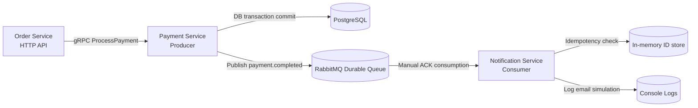

# Assignment 3 Architecture Diagram

```mermaid
flowchart LR
    O[Order Service\nHTTP API] -->|gRPC ProcessPayment| P[Payment Service\nProducer]
    P -->|DB transaction commit| DB[(PostgreSQL)]
    P -->|Publish payment.completed| MQ[(RabbitMQ Durable Queue)]
    MQ -->|Manual ACK consumption| N[Notification Service\nConsumer]
    N -->|Idempotency check| ID[(In-memory ID store)]
    N -->|Log email simulation| LOG[(Console Logs)]
```
